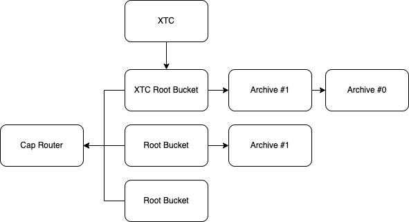

# Cap

Certified Asset Provenance (Cap), is a service for storing chronological
transaction logs for the Internet Computer services.

## Table of contents

If you need to know the alphabets of Cap, please read this README first,
then you can read any of the guides provided:

- [Rust SDK Integration guide](./Rust-SDK.md)
- Motoko SDK Integration guide

## Overview

If you're new to Cap, you may hear some terms being used frequently, such
as Router or Root bucket, here we will go briefly into what these things are,
and the responsibilities that each have.

### Router

Canister ID: `lj532-6iaaa-aaaah-qcc7a-cai`

The router canister is the entry point to the Cap network, meaning that
you only need to have the canister id for canister to access *all* of the
data that is stored in the Cap network.

Since it's the canister that basically knows *where things are*, and *routes*
the clients to other canisters for the actual data, it's called the **Router**.

You can view the candid of this canister [here](../candid/router.did).

### Root bucket

Every token contract using Cap for storing its history, is given a bucket
to write its data to. If a canister is storing data that exceeds the capacity
of a single canister (currently 4 GB), its data is split in several buckets.

In case there are multiple canisters, a chain of canisters is formed, starting
with a canister containing the most recent data, and ending with a canister that
holds the oldest data. This is better visualized by this diagram:



The first bucket, which *always* contains the most recent data is called the
root bucket.

You can view the candid of this canister [here](../candid/root.did).

## Case studies

We mentioned that you only need to know the principal id of the router canister,
to read all the data in Cap. Let's see what it means in practise:

### Query ICPunks transactions

ICPunks canister id: `qcg3w-tyaaa-aaaah-qakea-cai`

Like anything in Cap, we start by making a query to the Router, here we will
use the `get_token_contract_root_bucket` method to get the Root bucket associated
with this token contract.

```
> icx https://ic0.app/ query --candid ./candid/router.did lj532-6iaaa-aaaah-qcc7a-cai get_token_contract_root_bucket "(record { witness=false; canister=principal \"qcg3w-tyaaa-aaaah-qakea-cai\" })"
(
  record {
    witness = null;
    canister = opt principal "cvfe7-zqaaa-aaaah-qceqa-cai";
  },
)
```

Now, we learned the principal id of the root bucket associated with the ICPunks
canister, in case you missed it, it's: `cvfe7-zqaaa-aaaah-qceqa-cai`.

Now since it's a root bucket we can use the Root bucket interface to interact with
this canister. Let's begin by querying the number of transactions in this bucket:

```
> icx https://ic0.app/ query --candid ./candid/root.did cvfe7-zqaaa-aaaah-qceqa-cai size
(576 : nat64)
```

We can also request the transactions by the `get_transactions` method:

```
> icx https://ic0.app/ query --candid ./candid/root.did cvfe7-zqaaa-aaaah-qceqa-cai get_transactions "(record { witness=false })"
(
  record {
    data = vec { ... }
    page = 8 : nat32;
    witness = null;
  },
)
```

And the next page of the data can be queried by providing the page id:

```
> icx https://ic0.app/ query --candid ./candid/root.did cvfe7-zqaaa-aaaah-qceqa-cai get_transactions "(record { witness=false; page=opt (7:nat32) })"
(
  record {
    data = vec { ... }
    page = 7 : nat32;
    witness = null;
  },
)
```
